# Argus


---
Argus v0.1.0: 

**Corresponding authors**: Jie Li (lixx4611@umn.edu), Gilles Daviet (gdaviet@gmail.com), Rahul Narain (narain@umn.edu), Florence Bertails-Descoubes (florence.descoubes@inria.fr)

**[Project page](http://www-users.cselabs.umn.edu/~lixx4611/contact_friction.html)**

---

## Introduction

Argus is an adaptive cloth simulator with implicit frictional contact. It uses the open-source [So-Bogus](http://gdaviet.fr/code/bogus/) library for solving the Coulomb friction problem, and a modified version of [ARCSim](http://graphics.berkeley.edu/resources/ARCSim/index.html) for the adaptive cloth model with anisotropic remeshing.


If you use Argus for research, please cite the following paper:

* Jie Li, Gilles Daviet, Rahul Narain, Florence Bertails-Descoubes, Matthew Overby, George Brown, Laurence Boissieux. "An Implicit Frictional Contact Solver for Adaptive Cloth Simulation". *ACM Transactions on Graphics (Proc. SIGGRAPH)*, 2018.

Other earlier papers may also be cited:

**Reference paper for So-Bogus**:

* Gilles Daviet, Florence Bertails-Descoubes, and Laurence Boissieux. "A Hybrid Iterative Solver for Robustly Capturing Coulomb Friction in Hair Dynamics". *ACM Transactions on Graphics (Proc. SIGGRAPH Asia)*, 2011. 

**Reference papers for ARCSim**:

* Rahul Narain, Armin Samii, and James F. O'Brien. "Adaptive Anisotropic Remeshing for Cloth Simulation". *ACM Transactions on Graphics (Proc. SIGGRAPH Asia)*, 2012.
* Rahul Narain, Tobias Pfaff, and James F. O'Brien. "Folding and Crumpling Adaptive Sheets". *ACM Transactions on Graphics (Proc. SIGGRAPH)*, 2013.

The ARCSim license requires that any publication that uses code based on it should cite the above two papers.


To install the Argus code, please see the [compilation instructions](INSTALL.md).

## Run

To run the simulation, the easiest way is to execute the Python scripts under the `examples` folder. The examples include the validation examples and characther animations with full garments:

### Validation examples (5 files):

Each file corresponds to one validation example shown in the paper. For instance, you can try running the following command to test if everything is correct so far.

```bash
python examples/box_and_cone.py
```

If all went well, you should be able to see a square cloth sheet above two obstacles. Once you hit the `Space` key, it should begin to simulate. Pressing `Space` again will pause the simulation.

> Note that this can only succeed if you compiled the project under `build` folder at the root of the project. If you compiled it somewhere else, you need to modify the following line in file `examples/argus.py` to the right path of the executable:
> ```python
> ARGUS = 'build/apps/argus-cloth'
> ```

You can also run the script `examples/argus_interface.py` directly. This allows you to save the simulated meshes (as OBJ files), and replay the generated sequence to save the images (as PNG files) for making videos. You can also choose to run an online (with display) or offline (headless) simulation. Run the following command to get detailed usage information:

```bash
python examples/argus_interface.py -h
```

Note that the generated sequence of OBJ files (or PNG files) contains as many files as frames simulated. By default, each frame lasts 32ms so the generated results are 31.25 FPS. The actual running timestep dt is the frame time divided by the number of timesteps per frame. If you want to generate a result with a different FPS or use another timestep, just tune the `frame_time` and `frame_step` in the json configuration files ([mentioned below](#others-not-in-the-paper)).

### Character examples (5 examples in total, under 5 repositories 'Arabesque', 'Clubbing', 'HipHop', 'Shawl', and 'Twist'):

Each repository contains between 2 and 4 files corresponding to variations of friction coefficients. **IMPORTANT:** To run the character examples, you need to have access to the corresponding character meshes (garment mesh + character motion mesh sequence), which are under private Inria license.

* For ACM replicability stamp reviewers: a private link has been provided to the reviewer(s) to download these files. These files should only be used for reviewing purposes.
* For regular users: please contact [laurence.boissieux@inria.fr](mailto:laurence.boissieux@inria.fr) and [florence.descoubes@inria.fr](mailto:florence.descoubes@inria.fr) to obtain a license.

Once you've downloaded the archive `argus_data_private_license.tar.gz`, please place it in the Argus root directory and follow these commands:

```bash
tar xfz argus_data_private_license.tgz
pushd data_private_license/meshes/character/ && for name in *.tgz; do echo "Extracting $name..."; tar xfz $name; done && popd
```

Then you'll be able to run the character examples. For instance, using the command line below will run the Arabesque example with friction coefficient = 0.3:

```bash
python examples/character/Arabesque-0-3.py
```

### For ACM replicability stamp reviewers:

There is a script you can use to run all the examples in the paper and provide the performance data as shown in Table 2 in the paper. Run the following command and the performance data will be saved to the file `performance.txt` under the project folder:

```bash
bash examples/run_all.sh
```

### Others (not in the paper):

To create your own simulation, you can create the `json` files following those in folder `conf` and execute `build/apps/argus-cloth` directly. See the following section for more details.

## More about commands

**Simulation.** You can run the following commands to run a full simulation either online or offline. The config files are placed in `conf` folder. The output directory indicates the location you want to save the intermediate object files, which is optional.

```
build/apps/argus-cloth simulate <config file> [output dir]
build/apps/argus-cloth simulateoffline <config file> [output dir]
```

**Resume.** If you saved the object files in simulation, you can rerun the simulation from any frame you want by the command `resume` or `resumeoffline` if you want to run it offline.

```
build/apps/argus-cloth resume <output dir> <frame>
build/apps/argus-cloth resumeoffline <output dir> <frame>
```

**Replay.** You can replay the simulated results if you saved the object files and save the screenshots of the simulation using the command `replay`. Image directory indicates the location you want to save the screenshots. These screenshots can be used to create the final videos.

```
build/apps/argus-cloth replay <output dir> [image dir]
```

**Control the view by mouse:**

* Drag with left mouse button down: rotate the camera.
* Drag with the middle mouse button down: translate the camera.
* Scroll the mouse wheel: zoom in/out.
* Press the key 'm' to show/hide the wireframes.

## Showcases

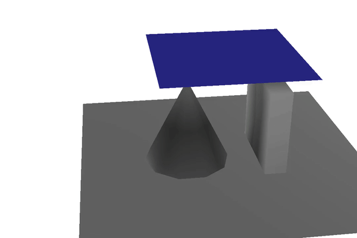 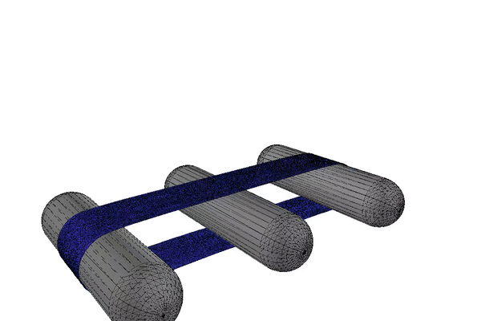
<br />

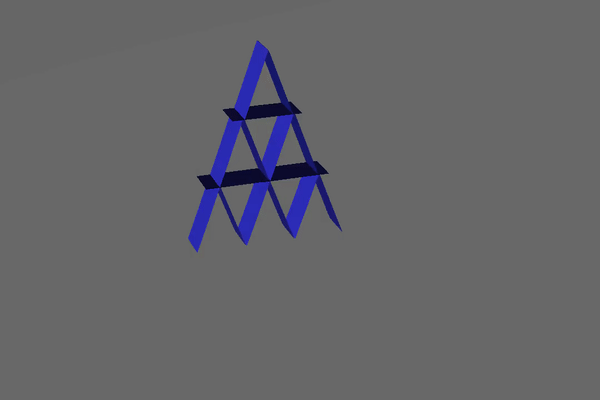 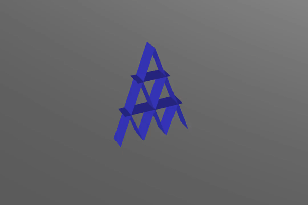
<br />

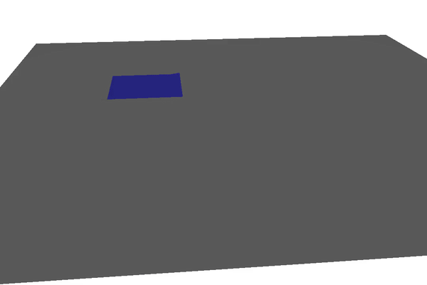
<br />

 
<br/>

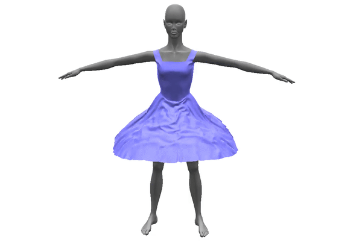 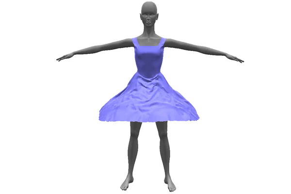
<br/>
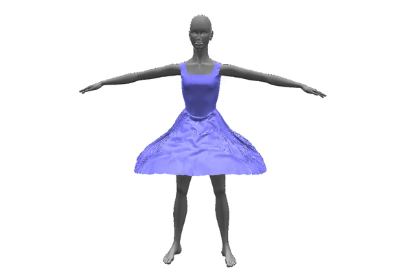
<br/>

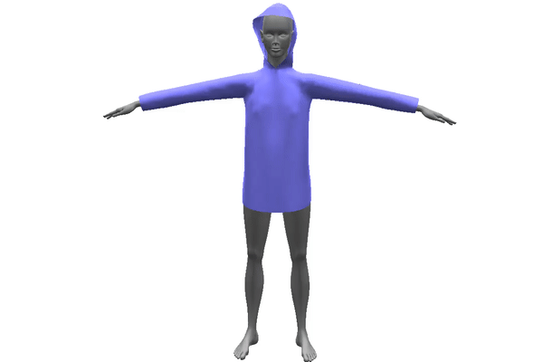 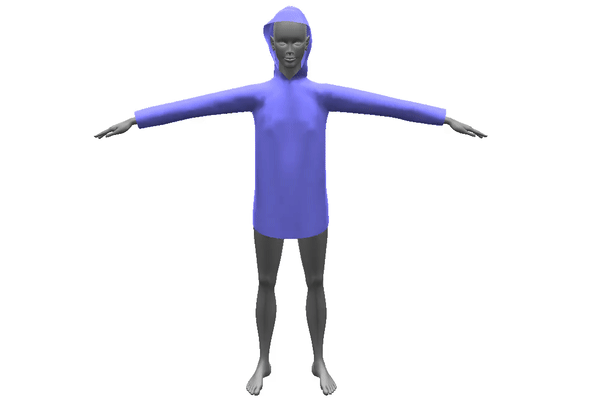
<br/>

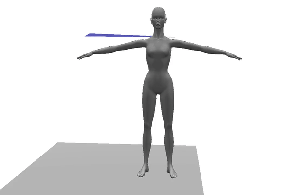 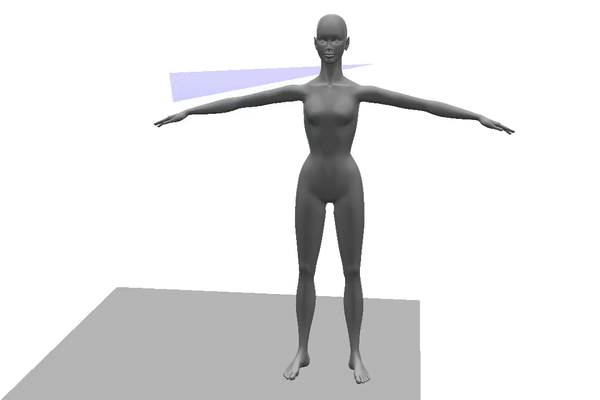
<br/>

 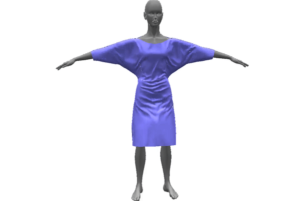
<br/>
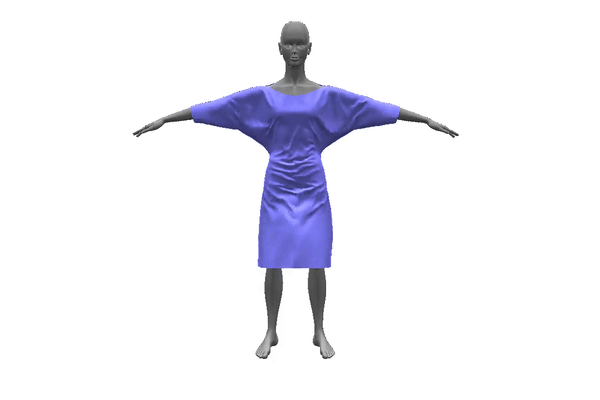 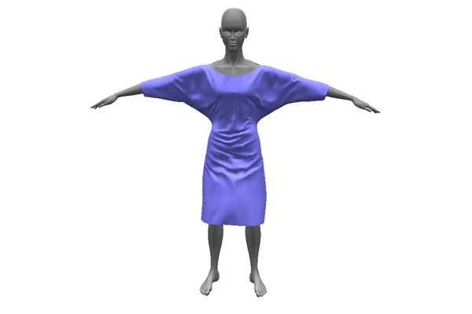
<br/>